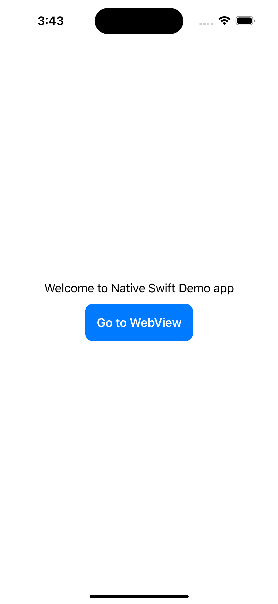
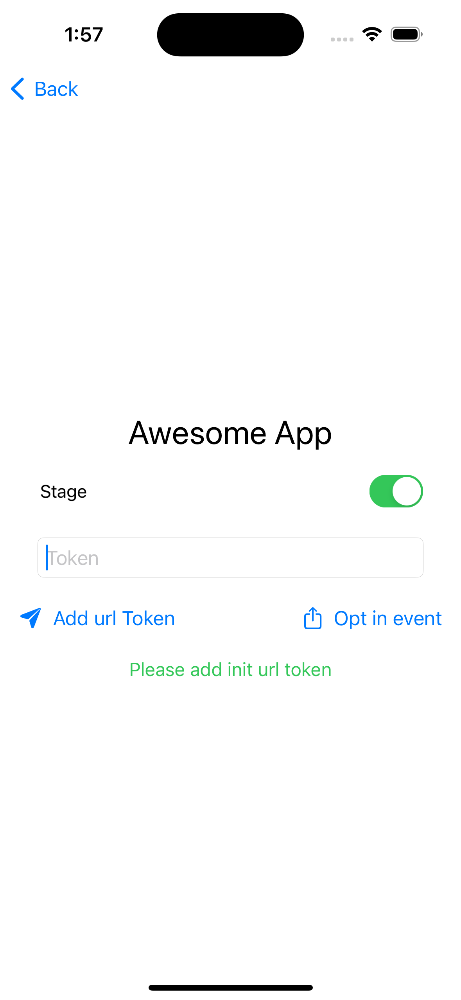

# demo-cloud-app-swift

  
  

## SwiftUI Token App
This is a simple SwiftUI app that demonstrates how to expose a token and pass it through a WebView. The app allows users to input a token and displays a WebView that loads a webpage using the provided token for authentication.

### Prerequisites
1. Xcode (minimum version: 12.0)
2. Swift 5.0 or later
3. iOS 13.0 or later

### Installation
1. Clone or download the repository to your local machine.
2. Open the project in Xcode.
3. Add valid initial token to constants file.

### Usage
1. Open the project in Xcode.
2. Build and run the app on the iOS simulator or a physical device.
3. The app will launch and display a screen with a text field and a button.
4. Enter your token in the text field and tap the "Sent Auth Token" button.
5. The WebView will load a webpage using the provided token for authentication.

#### Optional
6. Can simulate a webview event message tapping on "Opt in event" button, review xcode logs to get default message.

### Code Structure
The project follows a simple structure:

ContentView.swift: Contains the main view of the app, including the text field, button, and WebView.
WebViewWrapper.swift: Manages the interaction between the WebView and the app. It handles loading the webpage and passing the token as javascript injected script.
WebViewUI.swift: Base webview UI, implementes webViewWrapper.

### Customization
You can customize the app to fit your specific needs. Here are a few suggestions:

* Modify the UI: Update the ContentView.swift file to change the appearance and layout of the main view.
* Add additional functionality: Extend the WebViewWrapper.swift file to include more features, such as handling authentication callbacks or interacting with the loaded webpage.
